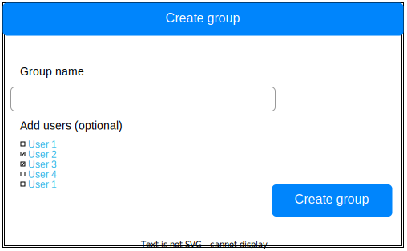
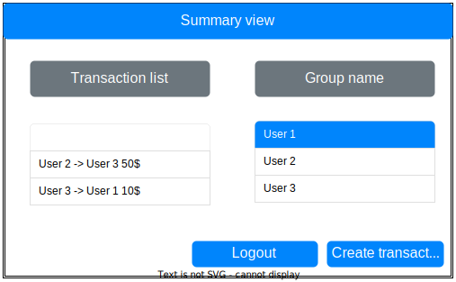

# SplitWiser

## Contributors

* Barbara Gaweł-Kucab
* Jędrzej Ziebura
* Mikołaj Wielgos

## Changelog

[Available here](./docs/changelog.md)

## Architecture

### Legacy Model

 This model is the first draft that was created in the beginning of the project.

New model is displayed below
*here should be the ss, draft in draw.io is ready*

### Views

During the implementation of the GUI/Client side the views changed slightly, but the core idea and 85% of the looks remain the same

### Server endpoints

Base url: `/api`

#### user

* `GET /users`
* `GET /user/{id}`
* `POST /user/{id}/payments`

#### payment

* `GET /payments`
* `GET /payment/{id}`
* `POST /payment/group/{groupId}`

#### group

* `GET /groups`
* `GET /group/{id}`
* `GET /group/{id}/members`
* `GET /group/{id}/payments`
* `POST /group`

### Database

#### Datebase diagram

#### Groups

#### Users

#### Payments

#### Payments receivers users

### JavaFx Views

